# Hydra — System Workflow Diagrams

> All diagrams use [Mermaid](https://mermaid.js.org/) syntax and render in GitHub,
> GitLab, VS Code (Mermaid Preview), and most modern markdown viewers.

---

## 1. High-Level Architecture

Overall component topology and protocol boundaries.

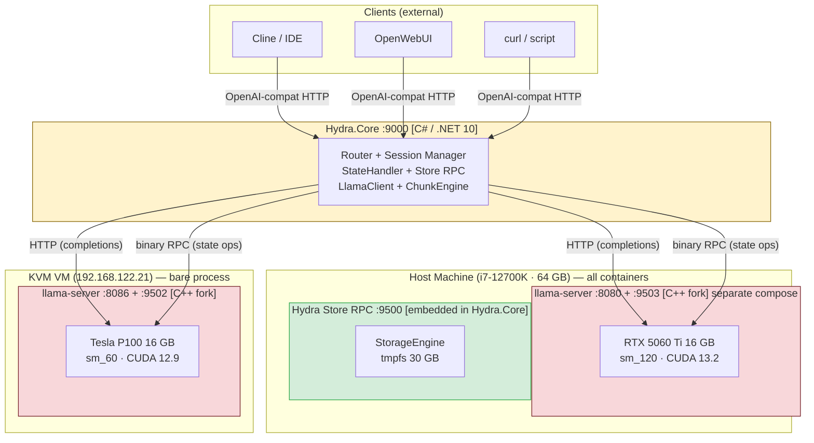

---

## 2. Normal Inference Request Flow

A request arriving while a session's KV state already lives on one GPU.
**Completions are proxied Hydra.Core → llama-server over HTTP**, not via any
intermediary. The RPC channel is used for state save/restore and health.

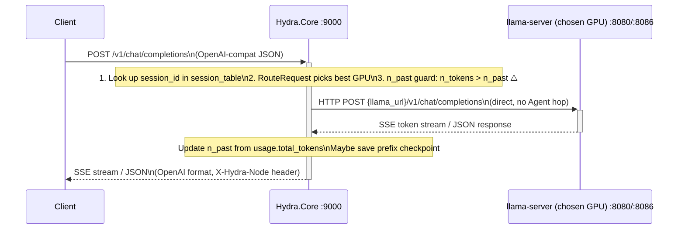

---

## 3. KV State Migration Flow

The core value proposition: move an 800 MB KV cache between GPUs without re-prefill.

```mermaid
sequenceDiagram
    participant Client
    participant Core as Hydra.Core :9000
    participant LlamaRTX as llama-server RTX :8080/:9503
    participant Store as Store RPC :9500
    participant LlamaP100 as llama-server P100 :8086/:9502

    Client->>Core: POST /v1/chat/completions\n(session on P100 needed)

    Note over Core: Session table shows KV state\ncurrently on RTX. Must migrate.

    rect rgb(255, 243, 205)
        Note over Core,Store: ── Phase 1: Save from source GPU (chunked dedup) ──
        Core->>+LlamaRTX: RPC STATE_GET (0x30) → GET /slots/0/state\n(binary stream ~800 MB)
        LlamaRTX-->>-Core: HTTP 200 + raw KV bytes\nX-Hydra-N-Past: 2968
        Core->>+Store: RPC PUT_CHUNKED (0x10) + PUT_META (0x14)\nkey="kv/{session_id}"
        Store-->>-Core: RPC OK\n(deduped chunks → tmpfs)
        Core->>LlamaRTX: POST /slots/{id}/erase\n(free source VRAM)
    end

    rect rgb(204, 229, 255)
        Note over Core,LlamaP100: ── Phase 2: Restore to destination GPU ──
        Core->>+Store: RPC GET_CHUNKED (0x11, known hashes)\n+ GET_MANIFEST (0x33)
        Store-->>-Core: RPC OK + missing chunks\n(sendfile() zero-copy from tmpfs)
        Core->>+LlamaP100: RPC STATE_PUT (0x31) → PUT /slots/0/state\n(reassembled ~800 MB)
        LlamaP100-->>-Core: {"restored":true, "n_past":2968}
    end

    Note over Core: Update session_table:\nsession now on P100, slot 0

    Core->>+LlamaP100: HTTP POST /v1/chat/completions\n(direct; n_tokens > 2968 ⚠️)
    LlamaP100-->>-Core: response (cache_n=2968 ✅)
    Core-->>Client: response\n(no re-prefill — 12 min saved)
```

---

## 4. RPC Protocol Message Structure

Binary wire format for all inter-service communication.

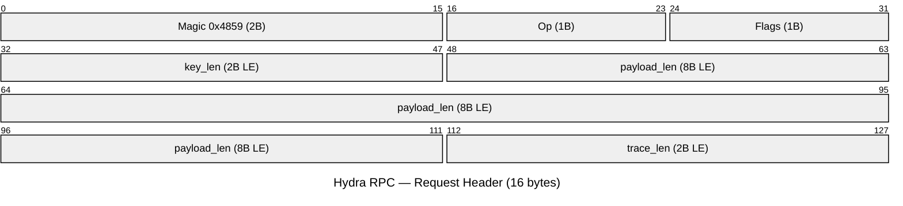

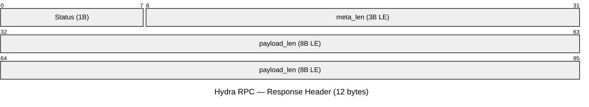

### Operation Code Map

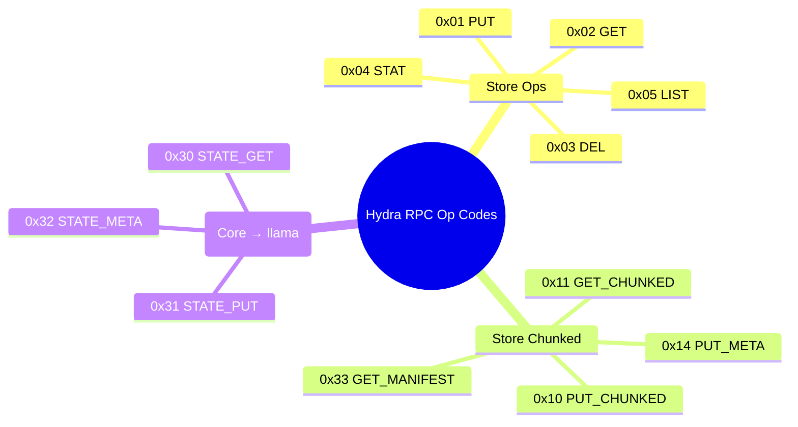

---

## 5. Service Startup & Dependency Order

Which services must be running before others can start.

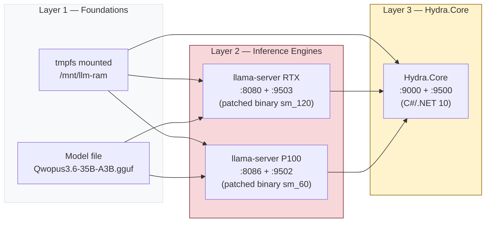

---

## 6. Milestone Dependency Graph

Development sequence — what blocks what.

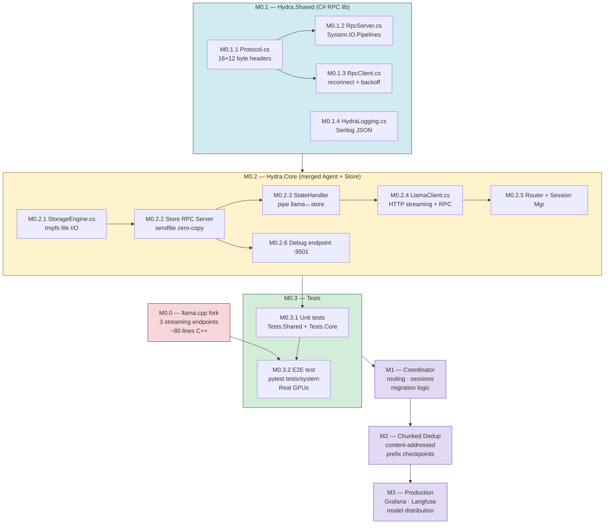

---

## 7. State Handler — Stream Piping (Save Path)

How 800 MB flows from GPU VRAM to tmpfs **without touching disk or RAM** as a buffer.

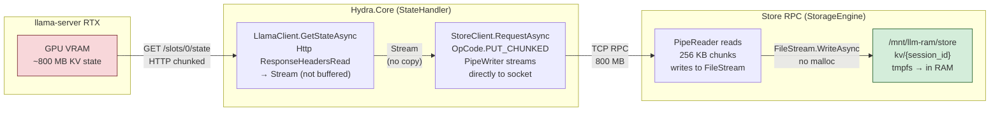

---

## 8. Coordinator Routing Algorithm (4-tier)

Actual decision tree in `RouteRequest()`.

```mermaid
flowchart TD
    A([POST /v1/chat/completions]) --> B{session_table\nlookup}

    B -->|Found AND node healthy| T1["Tier 1 — Session Affinity\nRoute to existing node\n(zero overhead)"]
    B -->|Found AND has_store_state| T2["Tier 2 — Store Restore\nRESTORE_STATE_CHUNKED\non least-loaded worker"]
    B -->|Not found| C{estimated_tokens\n≥ long_prompt_threshold?}

    C -->|Yes| T3["Tier 3 — Long-prompt\nSelect highest-priority\nPREFILL worker\n(prefill_priority ASC, load ASC)"]
    C -->|No| T4["Tier 4 — Least-loaded\nload = busy_fraction\n= (total−idle+in_flight)/total\nRound-robin tiebreak"]

    T2 --> POST[Update session_table\nnode + n_past]
    T3 --> NEW[register() new session]
    T4 --> NEW

    POST --> GUARD{n_past guard:\nestimated < n_past × 0.85?}
    NEW --> PREFIX["Prefix checkpoint?\nRESTORE 'prefix/{prompt_hash}'\nif same system prompt seen before"]
    T1 --> GUARD

    PREFIX --> GUARD
    GUARD -->|Yes ⚠️| RESET["reset n_past=0\nSLOT_ERASE\n(re-prefill silently)"]
    GUARD -->|No ✅| FWD

    RESET --> FWD["Forward to llama-server\n(HTTP proxy)"]
    FWD --> STREAM([SSE stream → Client\nX-Hydra-Node header])
    STREAM --> NPAST["Update n_past from\nusage.total_tokens\nMaybe save prefix checkpoint"]

    style T1 fill:#d4edda,stroke:#155724
    style T2 fill:#cce5ff,stroke:#004085
    style T3 fill:#fff3cd,stroke:#856404
    style T4 fill:#f8f9fa,stroke:#6c757d
    style GUARD fill:#fff3cd,stroke:#856404
    style RESET fill:#f8d7da,stroke:#721c24
```

---

## 9. llama-server Fork — Patched Endpoints

The three endpoints added to `tools/server/server.cpp` in the `hydra-state-streaming` branch.


---

## 10. Performance & Scale Reference

Key numbers from POC verification.

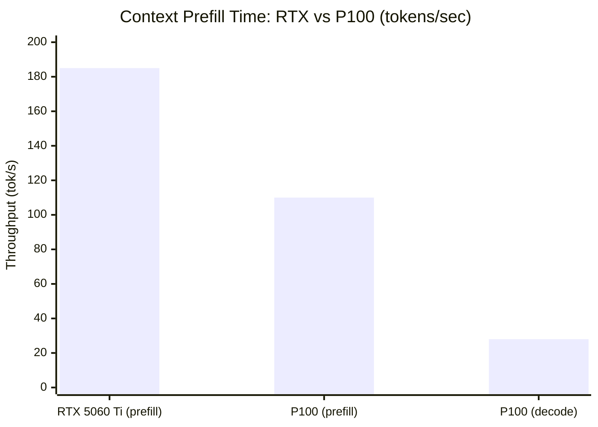

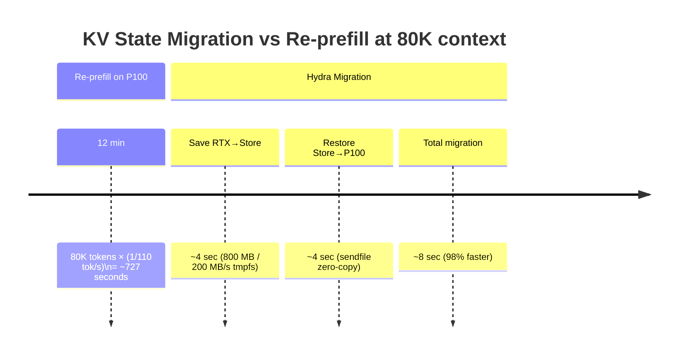

---

## 11. P/D Disaggregation Flow (`run_mode = "concurrency"`)

Implemented in `Hydra.Core`. RTX prefills; P100 decodes. Targets M-Perf.3.

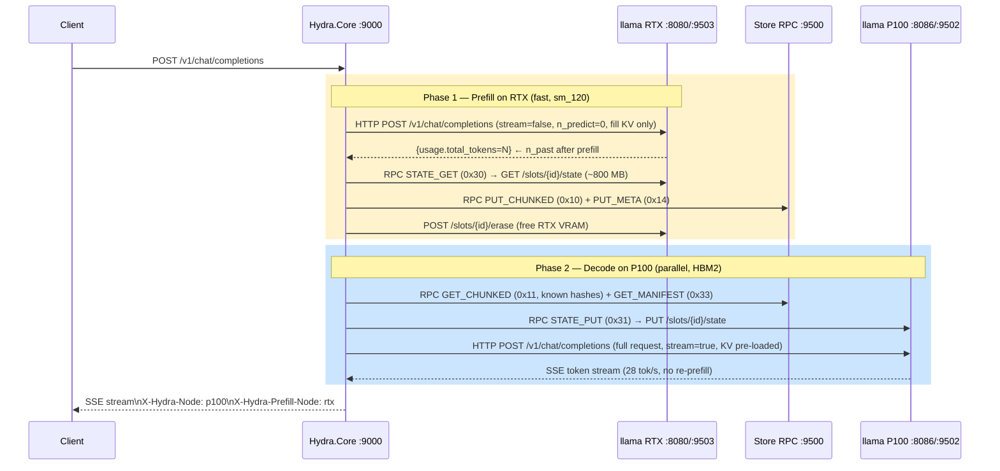

---

*See `docs/architecture.md` for conceptual detail. Source of truth: `specs/rpc-protocol.md`, `src/core/Hydra.Core/`.*
